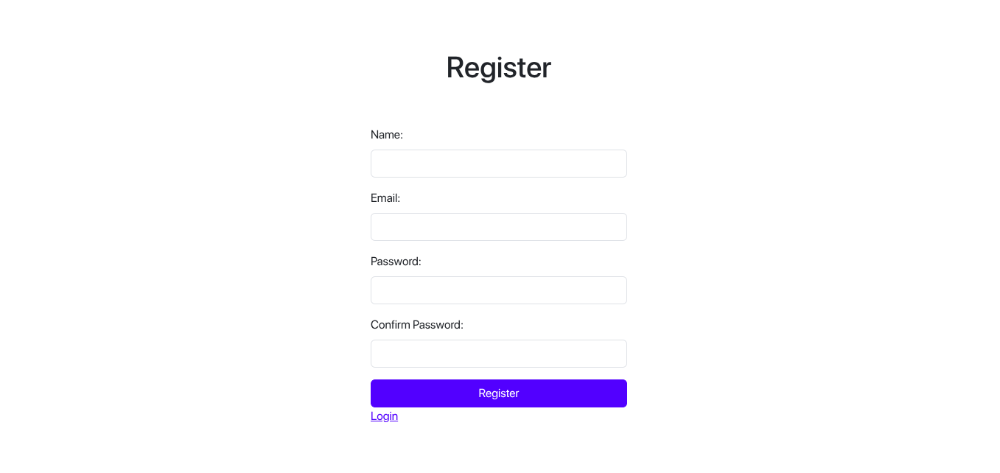
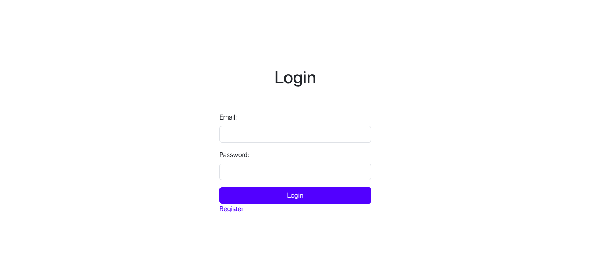
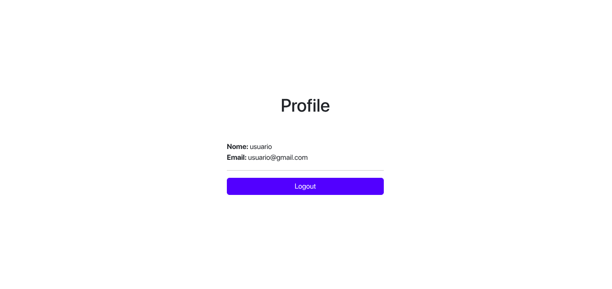

# FULLSTACK AUTHENTICATION

### 💻 Sobre o projeto

- Projeto desenvolvido com o objetivo de praticar a implementação de autenticação de usuários em uma aplicação full stack.

- A autenticação é realizada utilizando cookies HTTP, onde, após o login, um token é gerado no backend e armazenado em um cookie seguro no navegador do cliente. Esse cookie é automaticamente enviado nas requisições subsequentes, permitindo a validação da sessão do usuário sem a necessidade de armazenar tokens manualmente no frontend.  

- Objetivo do projeto: 
    - Entender autenticação baseada em cookies.
    - Trabalhar com rotas protegidas no backend.
    - Integrar frontend e backend de forma pratica e segura.
    - Aplicar boas práticas de segurança em autenticação.

### 🎨 Layout

- A baixo o design da aplicação em execução.

    

    

    

### 🛠 Tecnologias

- As seguintes ferramentas foram usadas na construção do projeto:

- REACTJS (react-router-dom, bootstrap)
- NODEJS (express, validator, mongoose, jsonwebtoken, dotenv, cors, cookie-parser, bcrypt)
- MONGODB

### 📝 Licença

- Fique a vontade para contribuir...

- Feito com ❤️ por Irani Junior 👋🏽